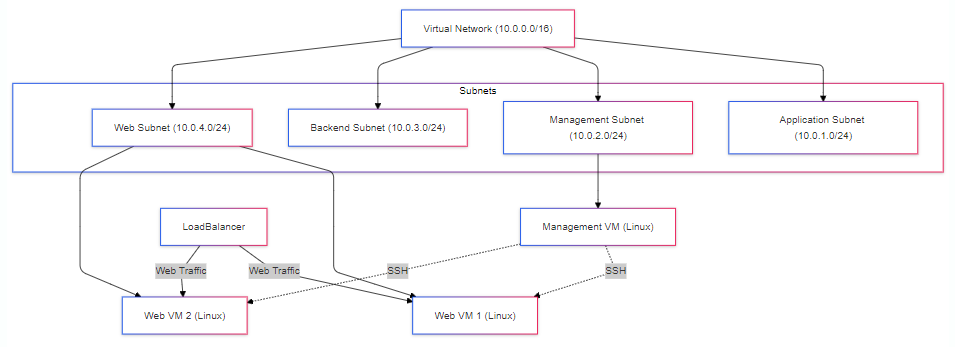

# Azure Network Diagram

## Virtual Network (VNet)
- **Address Space:** 10.0.0.0/16

## Subnets
- **Application Subnet:** 10.0.1.0/24
- **Management Subnet:** 10.0.2.0/24
- **Backend Subnet:** 10.0.3.0/24
- **Web Subnet:** 10.0.4.0/24

## Compute

### Web Subnet
- **2 Virtual Machines (Linux) in an Availability Set**
    - **NSG Rules:**
        - Allow SSH from Management VM
        - Allow web traffic from the Load Balancer
        - Deny all other external traffic
    - **Script:** Install Apache

### Management Subnet
- **1 Virtual Machine (Linux)**
    - **NSG Rules:**
        - Allow SSH from a specific IP or network space only

## Diagram
